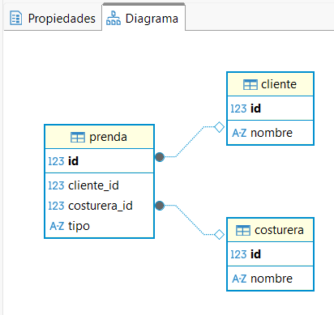

# Proyecto: Gestión de Taller de Costura

**Integrante:** Carolina Martínez Mesa (1020403128)

---

## 1. Tema, Entidades y Relaciones

### Tema

Sistema de gestión para la administración de pedidos y confección en un taller de costura, integrando clientes, prendas y personal técnico.

### Entidades

- **Cliente:** Persona que solicita el servicio de confección.
- **Prenda:** El artículo textil específico que se va a fabricar.
- **Costurera:** Personal técnico responsable de la manufactura.

### Relaciones

- **Cliente - Prenda (1:N):** Un cliente puede encargar múltiples prendas, pero cada prenda pertenece a un solo cliente.
- **Prenda - Costurera (1:1):** Cada prenda tiene asignada una única costurera responsable para asegurar la calidad y el seguimiento del trabajo.

---

## 2. Breve explicación del funcionamiento

La aplicación utiliza **Spring Boot** y **JPA** para automatizar la gestión del taller. Cuando se registra una nueva prenda, el sistema permite asociarla a un cliente existente y asignarle inmediatamente una costurera. Gracias a la configuración de **Hibernate**, las tablas y sus restricciones de integridad (llaves primarias y foráneas) se generan automáticamente en la base de datos **PostgreSQL**, garantizando que los datos estén siempre sincronizados con el código Java.

---

## 3. Gráfico del Modelo Relacional

El siguiente diagrama ha sido generado automáticamente mediante la herramienta **DBeaver**, reflejando la estructura física de la base de datos:
